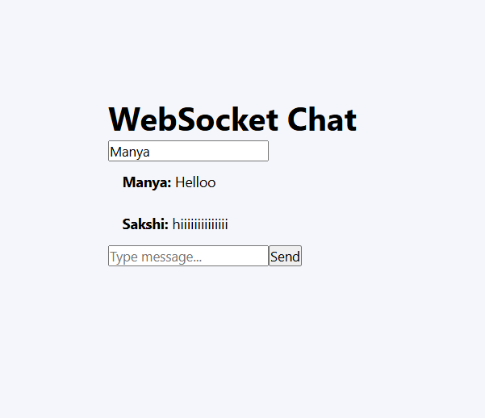
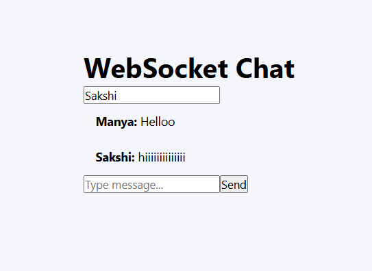
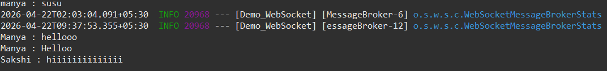

# 📡 Real-Time Chat Application using Spring Boot WebSocket & React (Vite)

## 📌 Experiment Title
Implementation of Real-Time Chat System using WebSockets (STOMP Protocol) with Spring Boot and React

---

## 📖 Description
This project demonstrates a real-time chat application using Spring Boot (WebSocket) and React (Vite).

It enables multiple users to communicate instantly using WebSocket and STOMP protocol without refreshing the page.

---

## 🎯 Objectives
- Understand WebSocket communication  
- Implement STOMP protocol  
- Enable real-time messaging  
- Integrate React with Spring Boot  

---

## 🏗️ System Architecture

### Backend (Spring Boot)
- `/app` → client sends messages  
- `/topic` → server broadcasts messages  
- Endpoint: `/ws`  

### Frontend (React + Vite)
- Chat UI using React  
- Uses SockJS + STOMP.js  

---

## ▶️ How to Run

### Backend
```bash
mvn spring-boot:run
```

Server:
http://localhost:8080

Frontend
cd websocket
npm install
npm run dev

Open:
http://localhost:5173

📊 Output
Real-time messaging
Multiple users supported
No page refresh required

## 📸 Screenshots

### 🔹 Chat Interface (User 1)
[](./screenshots/chat-interface-user1.png)

---

### 🔹 Chat Interface (User 2)
[](./screenshots/chat-interface-user2.png)

---

### 🔹 Backend Console Output
[](./screenshots/backend-console-output.png)
Server logs showing message handling.


📁 Project Structure

Demo_WebSocket/
├── screenshots/

│   ├── chat-interface-user1.png

│   ├── chat-interface-user2.png

│   └── backend-console-output.png

├── README.md

📌 Key Concepts

WebSocket vs HTTP

STOMP protocol

Publish-Subscribe model


🚀 Conclusion

This project demonstrates a real-time chat system using WebSockets with efficient communication between multiple users.
